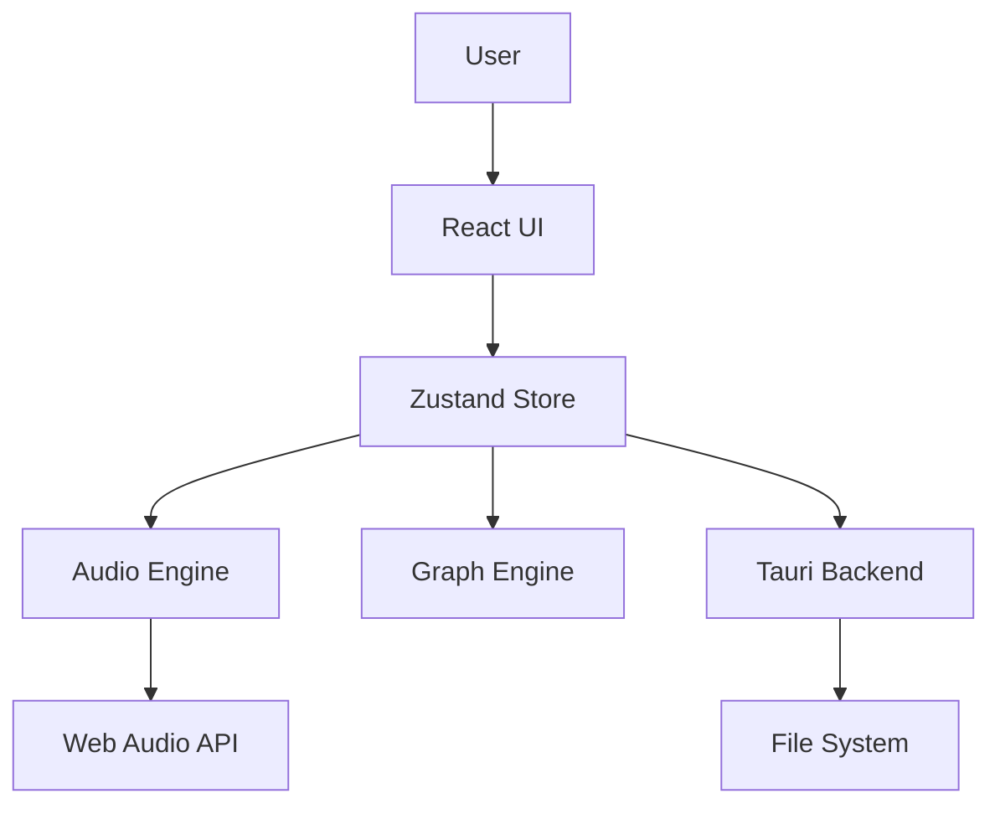

# Phonon Architecture

Phonon is a desktop application built using web technologies and the Tauri framework. It combines a React-based UI with a high-performance audio engine and a Rust-based backend for system integration.

## High-Level Overview

## Core Components

### 1. Frontend (React + TypeScript)
The user interface is built with React. It handles the visualization of the graph, user input, and property editing.
- **State Management:** `zustand` is used for global state management, with `immer` for immutable updates. The store (`src/core/store.ts`) is the single source of truth for the application.
- **Canvas:** The graph is rendered on an HTML5 Canvas (`src/ui/Canvas.tsx`) for performance, handling 60fps animations of packets and nodes.

### 2. Graph Engine (`src/graph`)
The core logic of the application. It defines the data structures for the musical graph.
- **Nodes:** Functional units (Source, Pitch, Speaker) that process packets.
- **Edges:** Connections between nodes that define the path of packets.
- **Packets:** Discrete units of musical data that travel along edges.

### 3. Audio Engine (`src/audio`)
A wrapper around the Web Audio API.
- **Renderer:** Manages the creation and scheduling of audio nodes (Oscillators, GainNodes).
- **Scheduling:** Uses the Web Audio clock for precise timing, decoupled from the visual frame rate.

### 4. Backend (Tauri / Rust)
Tauri provides the container for the web application and access to native system features.
- **File System:** Used for saving and loading projects (`.json` files) directly to the user's disk.
- **Dialogs:** Native file dialogs for opening and saving files.
- **Window Management:** Handling window resizing, menus, and lifecycle events.

## Directory Structure

- `src/audio`: Audio synthesis and scheduling logic.
- `src/core`: Core application logic, constants, and state management.
- `src/graph`: Graph data structures and algorithms.
- `src/io`: Input/Output handling (MIDI, Serialization, Compiler).
- `src/ui`: React components for the interface.
- `src-tauri`: Rust code and configuration for the Tauri backend.
- `doc`: Documentation and design documents.

## Data Flow

1.  **User Action:** User clicks "Play".
2.  **State Update:** `setIsPlaying(true)` is called in the Zustand store.
3.  **Graph Simulation:** The `useAnimationLoop` hook triggers the graph engine to advance the simulation.
4.  **Packet Emission:** A Source node emits a packet.
5.  **Audio Scheduling:** When a packet reaches a Speaker node, the Audio Engine schedules a sound event on the Web Audio Context.
6.  **Visual Update:** The Canvas re-renders to show the packet moving along the edge.
