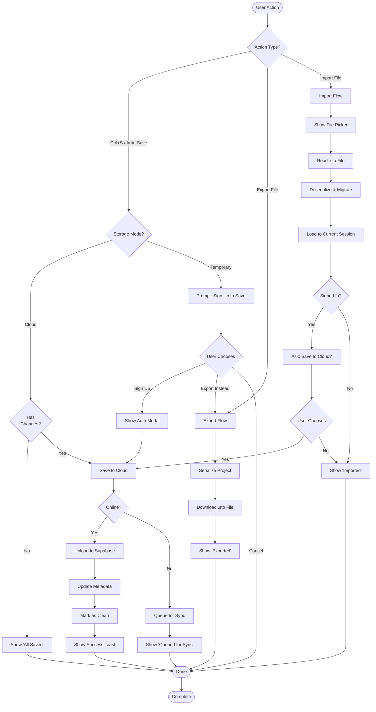
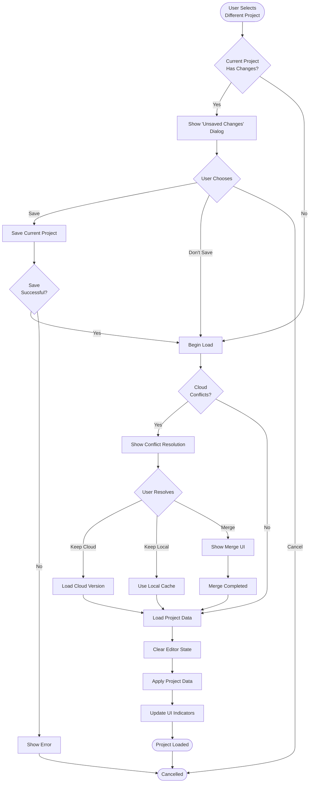

# Project Management UX Analysis & Improvement Plan

**Document Version:** 2.0  
**Date:** December 12, 2025  
**Status:** Proposal  
**Scope:** Web Application (Cloud + File Import/Export)

---

## Executive Summary

The current project management system in Stochastic has multiple storage modes (cloud storage, in-memory sessions, and file import/export) that create confusion for users. This document analyzes the current state for the web application, identifies UX issues, and proposes a unified, intuitive project management experience focused on cloud-first workflow with file portability.

---

## Table of Contents

1. [Current State Analysis](#current-state-analysis)
2. [Identified UX Issues](#identified-ux-issues)
3. [User Personas & Use Cases](#user-personas--use-cases)
4. [Activity Diagrams](#activity-diagrams)
5. [Proposed Solution](#proposed-solution)
6. [Implementation Roadmap](#implementation-roadmap)

---

## Current State Analysis

### Storage Modes

The web application currently supports two distinct storage modes with file portability:

#### 1. **Cloud Storage** (Supabase)
- **Location:** `src/io/cloud-storage.ts`
- **Features:**
  - Requires authentication
  - Stores projects in Supabase database
  - Supports project listing, save, load, delete
  - Has tier-based project limits (free tier limited)
  - Primary storage for logged-in users
  - Can export projects as `.sto` files
  - Can import projects from `.sto` files

#### 2. **In-Memory/Temporary Sessions**
- **Location:** `src/core/store/`
- **Features:**
  - Temporary session mode for unauthenticated users
  - No persistence unless explicitly exported
  - Default for non-authenticated users
  - Can export work as `.sto` files at any time
  - Can import `.sto` files to continue work

#### File Import/Export (Cross-cutting)
- **Location:** `src/io/file-io.ts`
- **Features:**
  - `.sto` file format (JSON)
  - Works with both cloud and temporary modes
  - Enables project portability and backups
  - Version migration support (v2 → v3)
  - Download/Web)
    ├─→ User Authenticated?
    │   ├─→ Yes: Load recent cloud projects
    │   └─→ No: Start temporary session
    │
During Work
    ├─→ Cloud (Authenticated):
    │   ├─→ Auto-save to cloud
    │   ├─→ Export as .sto file (backup/share)
    │   └─→ Import .sto file (restore/collaborate)
    │
    └─→ Temporary (Unauthenticated):
        ├─→ Work in memory only
        ├─→ Export as .sto file (save work)
        └─→ Import .sto file (load existing)
    
During Work
    ├─→ Cloud: Auto-save via ProjectsPanel
    ├─→ Local: Manual save/load via ProjectsPanel
    └─→ In-Memory: No persistence warning
```

### Data Model Conflicts

```typescript
//// Cloud project ID tracked separately in UI component state
  // No unified "current project" concept
  // No clear indicator of storage mode
  // File export/import disconnected from main workflow
  },
  // Cloud project ID tracked separately in UI component state
  // No unified "current project" concept
}
```

---

## Identified UX Issues

### 1. **Mode Confusion**
- **Problem:** Users don't understand which storage mode they're in
- **Impact:** Accidental data loss, confusion about where files are saved
- **Evidence:** No clear indicator of current mode in UI

### 2. **Disconnected Save Flows**
- **Problem:** Different save mechanisms for cloud vs. local
- **Impact:** Users must remember different workflows
- **Evidence:**Save to cloud vs. export to file are separate, confusing actions
- **Impact:** Users unclear about persistence vs. backup
- **Evidence:** 
  - Cloud save and file export are different UI elements
  - No unified Cmd+S / Ctrl+S handling
  - Unclear when to use "Save" vs "Export"
- **Problem:** Users can't tell if they have unsaved changes
- **Impact:** Accidental data loss when switching projects
- **Evidence:** `isDirty` flag exists but no clear UI indicator

### 4. **Ambiguous Project Identity**
- **Problem:** No clear "current project" concept
- **Impact:** Confusion about what's being saved/loaded
- **Evidence:** 
  - Cloud projects tracked by `currentProjectId` in component state
  - Tauri projects tracked by `project.path` in global state
  - No unified project identifier

### 5. **No Auto-Save**
- **Problem:** Users must manually save frequently
- **Iemporary sessions have no identity until exported
  - No unified project identifier in UIanism implemented

### 6. **Limited Project Metadata**
- **Problem:** Can't see project details without opening
- **Impact:** Hard to find/organize projects
- **Evidence:** Cloud projects show only name, date; no tags, categories, thumbnails

### 7. **No Conflict Resolution**
- **Problem:** Cloud sync conflicts not handled
- **Impact:** Potential data loss when editing same project on multiple devices
- **Evidence:** No conflict detection or merge strategyor thumbnails

### 8. **File Export/Import Hidden**
- **Problem:** File export/import not prominently featured in UX
- **Impact:** Users don't discover backup capability or collaboration workflow
- **Evidence:** Export/import buried in menus, not part of natural workflow
Casual Explorer** (Sarah)
- **Context:** First-time user trying Stochastic, not ready to commit
- **Goals:** 
  - Experiment without creating an account
  - Save interesting experiments as files
  - Optionally sign up later and migrate work
- **Pain Points:**
  - Forgets to export, loses work when tab closes
  - Doesn't know how to save progress
  - Can't tell if work is persisted

### Persona 2: **Cloud User** (Marcus)
- **Context:** Registered user working across multiple devices
- **Goals:**
  - Access projects from anywhere (work, home, mobile)
  - Automatic saves without thinking
  - Share projects with collaborators
  - Download backups for safety
- **Pain Points:**
  - Unclear when auto-save happens
  - No clear sync status
  - Doesn't know how to download backup
  - Can't easily share with non-users

### Persona 3: **Collaborator** (Aisha)
- **Context:** Works with team, shares projects via files
- **Goals:**
  - Download project from cloud
  - Share `.sto` file with teammate
  - Teammate edits and shares back
  - Import changes to cloud
- **Pain Points:**
  - File export/import not obvious
  - Unclear how to merge changes
  - Risk of overwriting workvices
  - Keep sketches local, publish finals to cloud
- **Pain Points:**
  - Must manually download/upload between modes
  - No clear sync status
  - Risk of overwriting changes
)  
**Goal:** Understand storage options and start creating

**Main Flow:**
1. User opens application
2. System shows banner: "🎵 Welcome! Your work is temporary. Sign up to save to cloud, or export as file anytime."
3. User chooses: "Try Now" (temporary) or "Sign Up" (cloud)
4. System creates empty project with clear mode indicator in status bar
5. User starts creating

**Alternate Flows:**
- **A1:** User wants to load example project
  - System loads example, marks as "Untitled (Example)"
  - User can save to cloud or export as file
- **A2:** User imports a `.sto` file
  - System loads file into temporary session
  - User can continue in temporary mode or sign up to save to cloud

**Success Criteria:**
- User understands current storage mode within 5 seconds
- User knows how to export work at any time
- No confusion about persistenceample project
  - System loads example, marks as "unsaved copy"
  - User can save to their storage

**Success Criteria:**
- User understands current storage mode
- User knows where their work will be saved
- No confusion about next steps

---

### UC-2: Auto-Save & Recovery

**Actor:** Active user with unsaved changes  
**Goal:** Ensure work is never lost

**Main Flow:**
1. User makes changes to project
2. System marks project as dirty (visual indicator)
3. After 30 seconds of inactivity, system auto-saves
4. System shows "Saved" confirmation
5. On crash/close, system auto-recovers unsaved work

**Alternate Flows:**
- **A1:** User is offline (cloud mode)
  - System queues changes locally
  - Syncs when connection restored
- **A2:** User tries to close with unsaved changes
  - SystemFile-Based Collaboration

**Actor:** Collaborator (Aisha)  
**Goal:** Share project with teammate who edits and returns it

**Main Flow:**
1. User creates project in cloud (signed in)
2. System auto-saves to cloud
3. User clicks "Export → Download .sto File"
4. System downloads `MyProject.sto`
5. User shares file via email/Slack with teammate
6. Teammate opens Stochastic, clicks "Import File"
7. Teammate uploads `MyProject.sto`, edits, exports as `MyProject_v2.sto`
8. User receives `MyProject_v2.sto`, imports it
9. System detects cloud project with same name
10. System prompts: "Update cloud project or save as new?"

**Alternate Flows:**
- **A1:** User is offline
  - User exports file, works locally in temporary mode
  - Later, user signs in and imports file to cloud
- **A2:** Teammate doesn't have account
  - Teammate works in temporary mode
  - Teammate exports when done
  - No cloud storage needed

**Success Criteria:**
- File export/import is intuitive
- No data loss in round-trip
- Clear prompts for conflictedited on both devices)
  - System shows diff/merge UI
  - User chCloud user (Marcus)  
**Goal:** Organize 50+ cloud projects efficiently

**Main Flow:**
1. User opens project manager (Cmd+O / Ctrl+O)
2. System shows cloud projects grouped by: Recent, Starred, Tags
3. User can: Search, Filter, Sort
4. User selects project
5. System shows preview thumbnail + metadata
6. User opens project or exports as backup

**Features:**
- Tags/labels (e.g., "work", "experimental", "client-xyz")
- Star favorites
- Archive old projects
- Bulk operations (delete, export all as .zip)
- Search by name, tags, date range
- Quick export individual project as .sto file

**Success Criteria:**
- Find any project in <5 seconds
- Export backup with one click, Sort
4. User selects project
5. System shows preview thumbnail + metadata
6. User opens project

**Features:**
- Tags/labels (e.g., "work", "experimental", "client-xyz")
- Star favorites
- Archive old projects
- Bulk operations (delete, export)
- Search by name, tags, date rCheckAuth{User<br/>Authenticated?}
    
    CheckAuth -->|Yes| LoadRecent[Load Recent Cloud Projects]
    CheckAuth -->|No| ShowWelcome[Show Welcome Banner]
    
    LoadRecent --> HasRecent{Has<br/>Projects?}
    HasRecent -->|Yes| LoadLast[Auto-load Last Opened]
    HasRecent -->|No| CreateCloud[Create First Cloud Project]
    
    ShowWelcome --> UserChoice{User Action}
    UserChoice -->|Try Now| CreateTemp[Start Temporary Session]
    UserChoice -->|Sign Up| ShowAuth[Show Auth Modal]
    UserChoice -->|Import File| ImportFile[Upload .sto File]
    UserChoice -->|Load Example| LoadExample[Load Example Project]
    
    ShowAuth --> AuthSuccess{Auth<br/>Success?}
    AuthSuccess -->|Yes| CreateCloud
    AuthSuccess -->|No| CreateTemp
    
    ImportFile --> LoadImported[Load File to Temp Session]
    LoadExample --> CreateTemp
    
    LoadLast --> InitProject[Initialize Project State]
    CreateCloud --> InitProject
    CreateTemp --> InitProject
    LoadImported --> InitProject
    
    InitProject --> ShowEditor[Show Main Editor]
    ShowEditor --> UpdateUI[Update Status Bar]
    UpdateUI
    SelectProject --> LoadProject
    SelectTemplate --> CreateNew
    
    CreateCloud --> InitProject[Initialize Project]
    CreateLocal --> InitProject
    CreateTemp --> InitProject
    
    WebStart --> CheckWebAuth{Authenticated?}
    CheckWebAuth -->|Yes| LoadCloudRecent[Load Recent Cloud Projects]
    CheckWebAuth -->|No| CreateTemp
    
    LoadCloudRecent --> InitProject
    LoadProject --> InitProject
    InitProject --> ShowEditor[Show Main Editor]
    ShowEditor --> End([Ready])
```

### Diagram 2: Save/Export Flow



### Diagram 3: Project Switching Flow



### Diagram 4: Offline/Online Sync Flow

```mermaid
graph TD
    Start([Connection<br/>State Change]) --> CheckState{New State?}
    
    CheckState -->|Offline| DisableCloud[Disable Cloud Features]
    CheckState -->|Online| CheckQueue{Pending<br/>Changes?}
    
    DisableCloud --> ShowOffline[Show Offline Indicator]
    ShowOffline --> QueueLocal[Queue Changes Locally]
    QueueLocal --> Wait([Wait for Connection])
    
    Wait --> ConnectionRestored{Connection<br/>Restored?}
    ConnectionRestored -->|Yes| CheckQueue
    ConnectionRestored -->|No| Wait
    
    CheckQueue -->|Yes| SyncQueue[Sync Queued Changes]
    CheckQueue -->|No| CheckRemote{Remote<br/>Changes?}
    
    SyncQueue --> UploadChanges[Upload to Cloud]
    UploadChanges --> ConflictCheck{Conflicts<br/>Detected?}
    
    ConflictCheck -->|Yes| ResolveConflict[Auto-Resolve or Prompt]
    ConflictCheck -->|No| UpdateRemote[Update Remote Version]
    
    ResolveConflict --> UpdateRemote
    UpdateRemote --> CheckRemote
    
    CheckRemote -->|Yes| DownloadRemote[Download Changes]
    CheckRemote -->|No| UpdateUI[Update Sync Status UI]
    
    DownloadRemote --> ApplyRemote[Apply Remote Changes]
    ApplyRemote --> UpdateUI
    UpdateUI --> ShowSynced[Show 'Synced' Status]
    ShowSynced --> Entemporary';
    
    // Cloud-specific
    cloudId?: string;
    cloudUserId?: string;
    lastSyncedAt?: number;
    
    // Sync state
    syncStatus: 'synced' | 'pending' | 'conflict' | 'offline';
    pendingChanges?: number;
    
    // File export info (for both modes)
    lastExportedAt?: number;
    lastExportedPath?: string;  // filename for referencell projects
  
  // Storage location
  storage: {
    type: 'cloud' | 'local' | 'temporary';
    
    // Cloud-specific
    cloudId?: string;
    cloudUserId?: string;
    lastSyncedAt?: number;
    
    // Local-specific
    localPath?: string;
    localFolder?: string;
    
    // Sync state
    syncStatus: 'synced' | 'pending' | 'conflict' | 'offline';
    pendingChanges?: number;
  };
  
  // Metadata
  meta: {
    name: string;
    author: string;
    description: string;
    tags: string[];
    starred: boolean;
    archived: boolean;
    thumbnail?: string;  // Base64 data URL
    
    created: number;
    modified: number;
    lastOpened: number;
    version: string;
  };
  
  // Content
  data: SerializedComposition;
  
  // State flags
  isDirty: boolean;
  isReadOnly: boolean;
}
```

### Storage Manager Architecture
TemporaryStorageProvider implements StorageProvider { 
  // Uses localStorage for crash recovery
  // No persistence across sessions unless exported
}

// File import/export utilities (cross-cutting)
class FilePortability {
  async exportToFile(project: UnifiedProject): Promise<File> {
    const serialized = serializeComposition(project.data);
    const blob = new Blob([JSON.stringify(serialized, null, 2)], { 
      type: 'application/json' 
    });
    return new File([blob], `${project.meta.name}.sto`);
  }
  
  async importFromFile(file: File): Promise<UnifiedProject> {
    const text = await file.text();
    const data = JSON.parse(text);
    const version = detectFileVersion(data);
    
    // Migrate if needed
    const migrated = version === '2.0' 
      ? migrateV2ToV3(data) 
      : data;
    
    return deserializeToProject(migrated);
  }
}

// Manager coordinates cloud and file operations
class ProjectStorageManager {
  private cloudProvider: CloudStorageProvider;
  private tempProvider: TemporaryStorageProvider;
  private filePortability: FilePortability;
  
  async save(project: UnifiedProject): Promise<SaveResult> {
    if (project.storage.type === 'cloud') {
      // Save to cloud
      const result = await this.cloudProvider.save(project);
      
      // Cache locally for offline access
      await this.tempProvider.cacheForOffline(project);
      
      return result;
    } else {
      // Temporary - only cache for crash recovery
      await this.tempProvider.save(project);
Cloud Mode:
┌──────────────────────────────────────────────────────┐
│ 🌩️ My Awesome Track  ✓ Synced  Last: 2m ago          │
│ ──────────────────────────────────────────────────── │
│ [Cloud] [⭐] [#work]     [↓ Export] [↻ Sync] [⚙️]    │
└──────────────────────────────────────────────────────┘

Temporary Mode:
┌──────────────────────────────────────────────────────┐
│ ⏱️ Untitled (Temporary)  Not Saved                    │
│ ──────────────────────────────────────────────────── │
│ [Temporary] ⚠️ Sign up to save  [↓ Export] [🔑 Sign In]│
└──────────────────────────────────────────────────────┘

States:
- ✓ Synced (green) - Cloud only
- ● Unsaved (orange dot) - Cloud only
- ↻ Syncing... (spinner) - Cloud only─────────────┐
│ Projects                   [+ New] [↑ Import File]│
├───────────────────────────────────────────────────┤
│ 🔍 Search...                        [☁️ Cloud Only]│
├───────────────────────────────────────────────────┤
│ ⭐ Starred                                        │
│   ├─ My Awesome Track  (☁️ Synced) [↓]          │
│   └─ Dark Ambient 01   (☁️ 2h ago) [↓]          │
│                                                   │
│ 📁 Recent                                         │
│   ├─ Experimental 42   (● Unsaved) [↓]          │
│   ├─ Client Demo      (☁️ Synced)  [↓]          │
│   └─ Live Jam Session (☁️ 1d ago)  [↓]          │
│                                                   │
│ 🏷️ Tags                                           │
│   ├─ #work (5)                                   │
│   ├─ #experimental (12)                          │
│   └─ #finished (3)                               │
│                                                   │
│ 📦 Archived (23)                                  │
└───────────────────────────────────────────────────┘

Features:
- Live search across cloud projects
- Filter by tags, date, starred
- Sort by: recent, name, modified
- [↓] Export button on each project
- [↑ Import File] prominently shown at top
- Right-click context menu: Open, Rename, Delete, Export, Duplicate, Archive
- Thumbnail previews on hover
- "Import File" converts to cloud project or opens in temp moderaryStorageProvider;
  
  async save(project: UnifiedProject): Promise<SaveResult> {
    const provider = this.getProvider(project.storage.type);
    
    // Save to primary storage
    const result = await provider.save(project);
    
    // If cloud project, also cache locally
    if (project.storage.type === 'cloud') {
      await this.localProvider.cacheCloudProject(project);
    }
    
    return result;
  }
  
  async auWelcome Banner** (First-run, non-authenticated)

```
┌────────────────────────────────────────────────────────┐
│ 🎵 Welcome to Stochastic!                              │
│                                                        │
│ You're in temporary mode. Your work won't be saved    │
│ unless you export it as a file or sign up for cloud   │
│ storage.                                               │
│                                                        │
│ [↓ Export Anytime] [🔑 Sign Up for Cloud] [Try Now →] │
└────────────────────────────────────────────────────────┘

Benefits shown on hover/click:
┌────────────────────────────────────────┐
│ Cloud Storage Benefits:                │
│ ✓ Auto-save across devices             │
│ ✓ Access from anywhere                 │
│ ✓ 10 projects free, unlimited with Pro │
│ ✓ Share with team                      │
│ ✓ Never lose work                      │
│                                        │
│ Plus you can always export files!      │
└────────────────────────────────────────────┘

States:
- ✓ Synced (green)
- ● Unsaved (orange dot)
- ↻ Syncing... (spinner)
- ⚠️ Conflict (red warning)
- 📴 Offline (gray)
```

#### 2. **Unified Project Manager** (Cmd+O / Ctrl+O)

```
┌──────────────────────────────────────┐
│ Projects                     [+ New] │
├──────────────────────────────────────┤
│ 🔍 Search...          [☁️] [📁] [⏱️] │
├──────────────────────────────────────┤
│ ⭐ Starred                           │
│   ├─ My Awesome Track  (☁️ Synced)   │
│   └─ Dark Ambient 01   (📁 Local)    │
│                                      │
│ 📁 Recent                            │
│   ├─ Experimental 42   (● Unsaved)   │
│   ├─ Client Demo      (☁️ Synced)   │
│   └─ Quick Sketch     (⏱️ Temp)      │
│                                      │
│ 🏷️ Tags                              │
│   ├─ #work (5)                       │
│   ├─ #experimental (12)              │
│   └─ #finished (3)                   │
│                                      │
│ 📦 Archived (23)                     │
└──────────────────────────────────────┘

Features:
- Live search
- Filter by storage type, tags, date
- Sort by: recent, name, modified
- Right-click context menu: Open, Rename, Delete, Export, Duplicate
- Thumbnail previews on hover
```

#### 3. **Auto-Save Indicator**

```
Bottom-right corner:

Normal: (hidden)
Dirty:  ● Unsaved changes
Saving: ⟳ Saving...
Saved:  ✓ Saved (fades out after 2s)
Error:  ⚠️ Save failed - Retry?
```

#### 4. **Storage Mode Selector** (First-run / Settings)

```
┌─────────────────────────────────────────┐
│ Choose Your Workspace Mode              │
├─────────────────────────────────────────┤
│                                         │
│  ☁️  Cloud Workspace                    │, enhance file portability

**Tasks:**
1. Create `UnifiedProject` type (cloud + temporary modes)
2. Implement `StorageProvider` interface for cloud and temporary storage
3. Build `FilePortability` utilities for seamless import/export
4. Build `ProjectStorageManager` coordinating cloud, temporary, and file operations
5. Add project ID to all existing storage operations
6. Migrate existing cloud projects to new format

**Success Metrics:**
- All storage operations use unified interface
- File export/import works reliably with version migration
- Zero data loss during migration
- Backward compatibility with .sto v2 and v3         │
│  → No account needed                    │
│  → Not saved unless exported            │
│  → Perfect for experiments              │
│                                         │
│ [Continue]             [Learn More →]   │
└─────────────────────────────────────────┘
```

### Auto-Save Strategy

```typescript
class AutoSaveManager {
  private saveTimer: NodeJS.Timeout | null = null;
  private readonly SAVE_DELAY_MS = 30000;  // 30 seconds
  private readonly MAX_PENDING_CHANGES = 100;
  
  onProjectChange(project: UnifiedProject) {
    // Mark dirty
    project.isDirty = true;
    
    // Cancel existing timer
    if (this.saveTimer) {
      clearTimeout(this.saveTimer);prominent file export/import, intuitive project management

**Tasks:**
1. Build Project Status Bar component (cloud vs. temporary mode indicators)
2. Redesign Project Manager dialog with prominent Import/Export
3. Replace startup modal with welcome banner for temporary mode
4. Add Export button to every project in list
5. Implement auto-save toast notifications
6. Add sync status indicators (cloud)
7. Add "Export" quick action to toolbar/menu

**Success Metrics:**
- User can identify storage mode in <2 seconds
- User can export file in <3 clicks
- User can import file and continue work seamlessly
- Zero confusion about temporary vs. cloud
  
  async performAutoSave(project: UnifiedProject) {
    if (project.storage.type === 'temporary') {
      // Cache to localStorage for recovery
      await this.cacheTemporary(project);
    } else {
      // Save to configured storage
      await this.storageManager.save(project);
    }
    
    project.isDirty = false;
    this.showSaveToast('Auto-saved');
  }
  
  // On app close/crash
  async beforeUnload(project: UnifiedProject) {
    if (project.isDirty) {
      // Block close and save
      await this.performAutoBulk Operations (1 week)

**Goals:** Help users organize large cloud project libraries, enable batch export

**Tasks:**
1. Add tags/labels system (cloud projects only)
2. Implement star/favorite
3. Build archive functionality
4. Add fuzzy search
5. Generate automatic thumbnails
6. Add "Export All" or "Export Selected" for bulk backup

**Success Metrics:**
- Users can organize 50+ cloud projects comfortably
- Search returns results in <100ms
- Thumbnail generation doesn't slow down UI
- Bulk export creates .zip with all .sto files
1. Create `UnifiedProject` type and migration utilities
2. Implement `StorageProvider` interface
3. Build `ProjectStorageManager` 
4. Add project ID to all existing storage operations
5. Migrate existing projects to new format

**Success Metrics:**
- All storage operations use unified interface
- Zero data loss during migration
- Backward compatibility with old files

---

## Detailed Implementation Steps

This section breaks down each phase into concrete, actionable development tasks.

---

### Phase 1: Foundation - Unified Storage Architecture (2 weeks)

**Objective:** Establish single source of truth for project metadata and storage state.

#### 1.1 Update Project Data Model
- **File:** `src/core/types.ts`
- **Action:** Extend `ProjectMetadata` interface:
  ```typescript
  interface ProjectMetadata {
    id: string;  // Unique identifier
    name: string;
    description?: string;
    created: number;  // timestamp
    modified: number;
    storage: {
      type: 'cloud' | 'temporary';
      cloudId?: string;
      cloudUserId?: string;
      lastSyncedAt?: number;
    };
    syncStatus: 'synced' | 'pending' | 'offline' | 'conflict';
    isDirty: boolean;
    tags?: string[];
    starred?: boolean;
    archived?: boolean;
  }
  ```
- **Checklist:**
  - [ ] Update interface
  - [ ] Add unit test for type validation
  - [ ] Update any type guards that check ProjectMetadata

#### 1.2 Create Unified Project Manager Module
- **File:** `src/core/store/projectManager.ts` (NEW)
- **Responsibilities:**
  - Single source of truth for current project
  - Track storage mode and dirty state
  - Sync status management
- **Functions to Export:**
  ```typescript
  export const projectManager = {
    init(project: ProjectMetadata): void;
    getCurrent(): ProjectMetadata;
    setCurrent(metadata: ProjectMetadata): void;
    getStorageMode(): 'cloud' | 'temporary';
    isDirty(): boolean;
    setDirty(dirty: boolean): void;
    getSyncStatus(): SyncStatus;
    setSyncStatus(status: SyncStatus): void;
  };
  ```
- **Checklist:**
  - [ ] Implement all getter/setter functions
  - [ ] Add state management (Zustand atom or React Context)
  - [ ] Write unit tests for each function
  - [ ] Ensure thread-safe (if applicable)

#### 1.3 Update StatusBar Component
- **File:** `src/ui/StatusBar.tsx`
- **Changes:**
  - Import `projectManager`
  - Add storage mode indicator:
    ```tsx
    const mode = projectManager.getStorageMode();
    <span className={styles.modeIndicator}>
      {mode === 'cloud' ? '☁️ Cloud' : '💾 Temporary'}
    </span>
    ```
  - Add dirty/unsaved indicator:
    ```tsx
    {projectManager.isDirty() && (
      <span className={styles.unsavedBadge}>● Unsaved</span>
    )}
    ```
  - Add sync status:
    ```tsx
    const syncStatus = projectManager.getSyncStatus();
    {syncStatus === 'pending' && <span>⟳ Syncing...</span>}
    {syncStatus === 'conflict' && <span>⚡ Conflict</span>}
    ```
- **File:** `src/ui/StatusBar.module.css`
- **Additions:**
  ```css
  .modeIndicator {
    padding: 0 8px;
    color: #666;
    font-size: 11px;
  }
  
  .unsavedBadge {
    color: #ff9800;
    font-weight: bold;
    margin-left: 4px;
  }
  ```
- **Checklist:**
  - [ ] Indicator displays correctly for both modes
  - [ ] Unsaved badge shows/hides on dirty changes
  - [ ] Sync status updates in real-time
  - [ ] No layout shift when badge appears

#### 1.4 Integrate projectManager into ProjectsPanel
- **File:** `src/ui/ProjectsPanel.tsx`
- **Changes:**
  - Replace local `currentProjectId` state with `projectManager.getCurrent().id`
  - When user selects project:
    ```typescript
    const handleSelectProject = async (project: ProjectMetadata) => {
      // Check for unsaved changes first
      if (projectManager.isDirty()) {
        const result = await showUnsavedChangesDialog();
        if (result === 'cancel') return;
      }
      
      // Load new project
      projectManager.setCurrent(project);
      // ... load project data
    };
    ```
  - Show storage mode in project list (cloud vs temp icon)
- **Checklist:**
  - [ ] Project selection uses projectManager
  - [ ] Unsaved changes dialog works
  - [ ] Storage mode indicators show correctly

#### 1.5 Refactor File I/O Layer
- **File:** `src/io/file-io.ts`
- **Changes:**
  - Update export function:
    ```typescript
    export async function exportProject(
      project: Project,
      metadata: ProjectMetadata,
      options?: { includeMetadata?: boolean; generateThumbnail?: boolean }
    ): Promise<Blob> {
      const data = {
        project,
        metadata,
        version: 3,
        exportedAt: Date.now()
      };
      return new Blob([JSON.stringify(data, null, 2)], { type: 'application/json' });
    }
    ```
  - Update import function to validate version and preserve storage info:
    ```typescript
    export async function importProject(
      file: File
    ): Promise<{ project: Project; metadata: ProjectMetadata }> {
      const text = await file.text();
      const data = JSON.parse(text);
      
      // Validate version and migrate if needed
      if (data.version < 3) {
        return migrateFromV2(data);
      }
      
      return {
        project: data.project,
        metadata: {
          ...data.metadata,
          modified: Date.now(),
          isDirty: false,
          syncStatus: 'pending'
        }
      };
    }
    ```
- **Checklist:**
  - [ ] Exports include full metadata
  - [ ] Imports validate file format
  - [ ] Version migration works (V2 → V3)
  - [ ] Edge cases handled (corrupt files, version mismatch)

#### 1.6 Create Unit Tests
- **File:** `src/core/store/projectManager.test.ts` (NEW)
- **Test Cases:**
  ```typescript
  describe('projectManager', () => {
    test('setCurrent and getCurrent work correctly', () => {});
    test('isDirty returns correct state', () => {});
    test('getStorageMode identifies cloud vs temporary', () => {});
    test('setSyncStatus updates status', () => {});
    test('Multiple rapid updates dont cause race conditions', () => {});
  });
  ```
- **File:** `src/io/file-io.test.ts` (NEW or extend)
- **Test Cases:**
  ```typescript
  test('exportProject includes metadata', () => {});
  test('importProject with v2 file migrates correctly', () => {});
  test('importProject preserves storage type on import', () => {});
  test('importProject rejects corrupt files', () => {});
  ```
- **Checklist:**
  - [ ] All new functions have tests
  - [ ] Edge cases covered (null, undefined, invalid)
  - [ ] Tests pass locally
  - [ ] Coverage >85%

#### Phase 1 Completion Checklist
- [ ] Types updated and backward compatible
- [ ] projectManager module complete and tested
- [ ] StatusBar displays mode, dirty state, sync status
- [ ] ProjectsPanel uses projectManager
- [ ] File I/O preserves metadata
- [ ] All unit tests passing
- [ ] Code review approved
- [ ] No console errors/warnings

---

### Phase 2: Auto-Save & Crash Recovery (2 weeks)

**Objective:** Prevent data loss through automatic saves and recovery.

#### 2.1 Implement Local Cache Layer
- **File:** `src/io/localCache.ts` (NEW)
- **Functions:**
  ```typescript
  export const localCache = {
    save(project: Project, metadata: ProjectMetadata): void;
    load(): { project: Project; metadata: ProjectMetadata } | null;
    clear(): void;
    hasCache(): boolean;
    getCacheTimestamp(): number | null;
  };
  ```
- **Implementation:**
  - Use `localStorage` with key: `stochastic_v3_cache`
  - Store both project and metadata
  - Include timestamp and project name for UI
  - Limit cache size (prune if >5MB)
- **Checklist:**
  - [ ] localStorage integration works
  - [ ] Can save/load large projects
  - [ ] Cache expires appropriately
  - [ ] Handles quota exceeded errors

#### 2.2 Create Auto-Save Hook
- **File:** `src/ui/hooks/useAutoSave.ts` (NEW)
- **Implementation:**
  ```typescript
  export function useAutoSave(
    project: Project,
    metadata: ProjectMetadata,
    options?: { delayMs?: number; enabled?: boolean }
  ): void {
    const { delayMs = 30000, enabled = true } = options || {};
    
    useEffect(() => {
      if (!enabled || metadata.storage.type !== 'cloud') return;
      if (!projectManager.isDirty()) return;
      
      const timer = setTimeout(async () => {
        projectManager.setSyncStatus('pending');
        try {
          await cloudStorage.saveProject(project, metadata);
          projectManager.setDirty(false);
          projectManager.setSyncStatus('synced');
          localCache.save(project, metadata);
        } catch (error) {
          projectManager.setSyncStatus('offline');
          // Queue for later sync
        }
      }, delayMs);
      
      return () => clearTimeout(timer);
    }, [project, metadata, enabled, delayMs]);
  }
  ```
- **Usage in App:**
  ```tsx
  function App() {
    const { graph, projectMeta } = useGraphStore();
    useAutoSave(graph, projectMeta, { enabled: isLoggedIn });
    // ...
  }
  ```
- **Checklist:**
  - [ ] Debouncing works correctly
  - [ ] Only saves in cloud mode
  - [ ] Handles network errors
  - [ ] Doesn't block UI

#### 2.3 Implement Crash Recovery
- **File:** `src/ui/RecoveryModal.tsx` (NEW)
- **Features:**
  - Show last cache timestamp
  - Display project name and size
  - Options: "Recover", "Discard", "View Details"
- **File:** `src/ui/App.tsx`
- **Integration:**
  ```typescript
  useEffect(() => {
    const cached = localCache.load();
    const currentProjectEmpty = graph.nodes.size === 0 && graph.edges.size === 0;
    
    if (cached && currentProjectEmpty) {
      setShowRecoveryModal(true);
      setRecoveryData(cached);
    }
  }, []);
  ```
- **Checklist:**
  - [ ] Recovery modal displays on crash
  - [ ] Recover button restores state
  - [ ] Discard button clears cache
  - [ ] Works even if app is partially broken

#### 2.4 Unsaved Changes Warning
- **File:** `src/ui/App.tsx`
- **Implementation:**
  ```typescript
  useEffect(() => {
    const handleBeforeUnload = (e: BeforeUnloadEvent) => {
      if (projectManager.isDirty() && 
          projectManager.getStorageMode() === 'cloud') {
        e.preventDefault();
        e.returnValue = 'You have unsaved changes. Are you sure?';
      }
    };
    
    window.addEventListener('beforeunload', handleBeforeUnload);
    return () => window.removeEventListener('beforeunload', handleBeforeUnload);
  }, []);
  ```
- **Checklist:**
  - [ ] Warning shows on page close with unsaved work
  - [ ] Only for cloud mode (temporary mode always loses data)
  - [ ] Doesn't trigger on normal navigation away

#### 2.5 Sync Status Display
- **Already done in Phase 1.3** - Update StatusBar to show sync status:
  - Synced ✓
  - Syncing ⟳
  - Offline ⚠️
  - Conflict ⚡

#### 2.6 Unit Tests
- **File:** `src/io/localCache.test.ts`
  ```typescript
  test('save and load preserves data', () => {});
  test('cache handles large projects', () => {});
  test('load returns null when no cache', () => {});
  ```
- **File:** `src/ui/hooks/useAutoSave.test.ts`
  ```typescript
  test('auto-save triggers after delay', () => {});
  test('auto-save skips temporary mode', () => {});
  test('auto-save handles network errors', () => {});
  ```
- **Checklist:**
  - [ ] All new functions tested
  - [ ] Integration tests for recovery flow
  - [ ] Performance tests (auto-save doesn't lag UI)

#### Phase 2 Completion Checklist
- [ ] Local cache persists to localStorage
- [ ] Auto-save works in cloud mode
- [ ] Crash recovery modal appears and works
- [ ] Unsaved changes warning displays
- [ ] Sync status updates correctly
- [ ] All tests passing
- [ ] Performance acceptable (<100ms auto-save latency)
- [ ] Code review approved

---

### Phase 3: Conflict Resolution & Offline Support (2 weeks)

**Objective:** Handle multi-device sync and offline scenarios without data loss.

#### 3.1 Implement Conflict Detection
- **File:** `src/io/conflictDetection.ts` (NEW)
- **Functions:**
  ```typescript
  export interface ConflictInfo {
    exists: boolean;
    local: { data: Project; timestamp: number };
    remote: { data: Project; timestamp: number };
    lastKnownSync: number;
  }
  
  export function detectConflict(
    local: { data: Project; timestamp: number },
    remote: { data: Project; timestamp: number },
    lastSync: number
  ): ConflictInfo;
  ```
- **Logic:**
  - If both modified after lastSync → conflict
  - If only one modified → no conflict (use newer)
  - If neither modified → no conflict
- **Checklist:**
  - [ ] Conflict detection logic correct
  - [ ] Handles edge cases (deleted files, etc.)
  - [ ] Unit tests comprehensive

#### 3.2 Create Conflict Resolution Modal
- **File:** `src/ui/ConflictResolutionModal.tsx` (NEW)
- **Features:**
  - Side-by-side diff view
  - Timestamps for each version
  - Three options:
    - "Keep Cloud" (discard local)
    - "Keep Local" (discard cloud)
    - "Merge" (if applicable)
  - Preview button to see full content
- **Checklist:**
  - [ ] Modal appears on conflict detection
  - [ ] User choice updates project correctly
  - [ ] No data loss occurs
  - [ ] Clear messaging about consequences

#### 3.3 Offline Mode
- **File:** `src/io/offlineManager.ts` (NEW)
- **Functionality:**
  ```typescript
  export const offlineManager = {
    isOnline(): boolean;
    onConnectionChange(callback: (online: boolean) => void): void;
    queueChange(project: Project, metadata: ProjectMetadata): void;
    getQueueSize(): number;
    flushQueue(): Promise<SyncResult>;
  };
  ```
- **Implementation:**
  - Listen to `navigator.onLine`
  - Queue changes when offline
  - Sync when connection restored
- **Checklist:**
  - [ ] Offline detection works
  - [ ] Changes persist in queue
  - [ ] Queue flushes automatically when online
  - [ ] No race conditions in queue handling

#### 3.4 Update Cloud Storage for Offline
- **File:** `src/io/cloud-storage.ts`
- **Changes:**
  ```typescript
  export async function saveProject(
    project: Project,
    metadata: ProjectMetadata
  ): Promise<{ synced: boolean; queued?: boolean }> {
    if (!offlineManager.isOnline()) {
      offlineManager.queueChange(project, metadata);
      projectManager.setSyncStatus('offline');
      return { synced: false, queued: true };
    }
    
    // Detect conflicts before save
    const remote = await fetchRemoteVersion(metadata.storage.cloudId!);
    const conflict = detectConflict(
      { data: project, timestamp: Date.now() },
      { data: remote, timestamp: remote.modified },
      metadata.storage.lastSyncedAt || 0
    );
    
    if (conflict.exists) {
      projectManager.setSyncStatus('conflict');
      showConflictModal(conflict);
      return { synced: false };
    }
    
    // Save to cloud
    const result = await supabase
      .from('projects')
      .upsert({ ...project, ...metadata });
    
    metadata.storage.lastSyncedAt = Date.now();
    projectManager.setSyncStatus('synced');
    return { synced: true };
  }
  ```
- **Checklist:**
  - [ ] Offline save queues correctly
  - [ ] Conflict detection works before save
  - [ ] Sync status updates appropriately

#### 3.5 Offline Indicator in UI
- **File:** `src/ui/StatusBar.tsx`
- **Addition:**
  ```tsx
  {!offlineManager.isOnline() && (
    <span className={styles.offlineWarning}>
      📴 Offline (Changes saved locally)
    </span>
  )}
  ```
- **Checklist:**
  - [ ] Appears when connection lost
  - [ ] Disappears when connection restored
  - [ ] Non-intrusive but visible

#### 3.6 Unit Tests
- **File:** `src/io/conflictDetection.test.ts`
  ```typescript
  test('detects conflict when both sides modified', () => {});
  test('no conflict when only one side modified', () => {});
  test('handles equal timestamps', () => {});
  ```
- **File:** `src/io/offlineManager.test.ts`
  ```typescript
  test('queues changes when offline', () => {});
  test('flushes queue on reconnect', () => {});
  test('handles partial syncs', () => {});
  ```
- **Checklist:**
  - [ ] All scenarios tested
  - [ ] Edge cases covered
  - [ ] Integration test for full offline→online flow

#### Phase 3 Completion Checklist
- [ ] Conflicts detected and resolved correctly
- [ ] Offline mode works transparently
- [ ] Queue flushes on reconnect
- [ ] Conflict modal is user-friendly
- [ ] No data loss in any scenario
- [ ] All tests passing
- [ ] Code review approved

---

### Phase 4: Project Organization & Search (2 weeks)

**Objective:** Enable users to manage libraries of 50+ projects comfortably.

#### 4.1 Extend Project Metadata
- **File:** `src/core/types.ts`
- **Additions:**
  ```typescript
  interface ProjectMetadata {
    // ... existing fields
    tags: string[];
    starred: boolean;
    archived: boolean;
    thumbnail?: string;  // base64 preview image
    description?: string;
    category?: string;  // e.g., 'experimental', 'client-work', 'finished'
  }
  ```
- **Checklist:**
  - [ ] Fields added to interface
  - [ ] Backward compatible with existing projects
  - [ ] Unit tests updated

#### 4.2 Database Schema Migration
- **File:** `supabase/migrations/20250112_add_project_metadata.sql` (NEW)
- **SQL:**
  ```sql
  ALTER TABLE projects ADD COLUMN (
    tags TEXT[],
    starred BOOLEAN DEFAULT false,
    archived BOOLEAN DEFAULT false,
    thumbnail TEXT,
    category VARCHAR(50),
    description TEXT
  );
  
  CREATE INDEX idx_projects_tags ON projects USING GIN(tags);
  CREATE INDEX idx_projects_starred ON projects(starred);
  CREATE INDEX idx_projects_archived ON projects(archived);
  CREATE INDEX idx_projects_modified ON projects(modified);
  ```
- **Checklist:**
  - [ ] Migration runs without errors
  - [ ] Indexes created for performance
  - [ ] Backward compatibility maintained

#### 4.3 Implement Search
- **File:** `src/io/projectSearch.ts` (NEW)
- **Functions:**
  ```typescript
  export interface SearchOptions {
    query?: string;
    tags?: string[];
    starred?: boolean;
    archived?: boolean;
    dateRange?: { start: number; end: number };
    sort?: 'name' | 'modified' | 'created';
    order?: 'asc' | 'desc';
  }
  
  export function searchProjects(
    projects: ProjectMetadata[],
    options: SearchOptions
  ): ProjectMetadata[];
  ```
- **Implementation:**
  - Fuzzy match on name (use fuzzy-search library)
  - Filter by tags (exact match, allow multiple)
  - Filter by starred/archived boolean
  - Filter by date range
  - Sort results
- **Checklist:**
  - [ ] Search <100ms for 100+ projects
  - [ ] Fuzzy matching works correctly
  - [ ] All filters combine properly
  - [ ] Results sorted as expected

#### 4.4 Project Manager Modal/Dialog
- **File:** `src/ui/ProjectManagerModal.tsx` (NEW)
- **Features:**
  - Search bar with real-time results
  - Filter pill buttons (tags, starred, archived)
  - Grid/list view toggle
  - Thumbnail previews (if available)
  - Action menu per project (open, rename, export, duplicate, archive, delete)
  - Bulk actions (select multiple, delete all, export all)
  - Right-click context menu
- **Layout:**
  ```
  ┌─────────────────────────────────────────┐
  │ Projects                          [Close]│
  ├─────────────────────────────────────────┤
  │ 🔍 [Search...] [⭐ Starred] [#Tags ▼]    │
  ├─────────────────────────────────────────┤
  │ Grid view (with thumbnails):            │
  │ ┌──────┐ ┌──────┐ ┌──────┐             │
  │ │thumb │ │thumb │ │thumb │             │
  │ │Name  │ │Name  │ │Name  │             │
  │ │Time  │ │Time  │ │Time  │             │
  │ └──────┘ └──────┘ └──────┘             │
  │                                         │
  │ [★] [↓] [⋮ Menu]  [★] [↓] [⋮ Menu]   │
  └─────────────────────────────────────────┘
  ```
- **Checklist:**
  - [ ] All search/filter combinations work
  - [ ] UI responsive and fast
  - [ ] Context menu functions correctly
  - [ ] Keyboard shortcuts (enter to open, del to delete)

#### 4.5 Thumbnail Generation
- **File:** `src/canvas/thumbnail.ts` (NEW)
- **Function:**
  ```typescript
  export async function generateThumbnail(
    canvas: HTMLCanvasElement,
    size: number = 200
  ): Promise<string>;  // base64 data URL
  ```
- **Implementation:**
  - Capture current canvas state
  - Resize to square (200x200px)
  - Convert to base64 PNG
  - Store in project metadata
  - Cache in localStorage temporarily
- **Performance:**
  - Async operation (doesn't block UI)
  - Debounced (only generate after 5s of inactivity)
  - Cached (don't regenerate if unchanged)
- **Checklist:**
  - [ ] Thumbnails generate without blocking
  - [ ] Saved in cloud with project
  - [ ] Displayed in project manager
  - [ ] Update when project changes

#### 4.6 Tag Management UI
- **File:** `src/ui/TagInput.tsx` (NEW)
- **Features:**
  - Type to add tags
  - Show existing tags as pills
  - Remove tag with X button
  - Suggest popular tags (autocomplete)
  - Auto-save to cloud
- **Checklist:**
  - [ ] Add/remove tags smoothly
  - [ ] Tags persist to cloud
  - [ ] Autocomplete suggestions helpful
  - [ ] No lag on typing

#### 4.7 Unit Tests
- **File:** `src/io/projectSearch.test.ts`
  ```typescript
  test('fuzzy search finds projects', () => {});
  test('tag filters work', () => {});
  test('multiple filters combine correctly', () => {});
  test('sorting works all directions', () => {});
  test('search performance is acceptable', () => {});
  ```
- **File:** `src/canvas/thumbnail.test.ts`
  ```typescript
  test('generates valid base64 image', () => {});
  test('thumbnail is square', () => {});
  test('generation is non-blocking', () => {});
  ```

#### Phase 4 Completion Checklist
- [ ] Search/filter working and fast
- [ ] Project manager modal complete
- [ ] Thumbnails generating and caching
- [ ] Tags system functional
- [ ] Cloud schema updated
- [ ] All tests passing
- [ ] Code review approved

---

### Phase 5: Import/Export UI & File Collaboration (1.5 weeks)

**Objective:** Make file-based collaboration discoverable and seamless.

#### 5.1 Enhance Export Modal
- **File:** `src/ui/ExportModal.tsx` (enhance)
- **New Features:**
  - Filename suggestion: `[ProjectName]_[Date].sto`
  - Checkbox: "Include Project Metadata"
  - Checkbox: "Include Thumbnail"
  - Checkbox: "Generate Backup .zip" (exports last 5 versions)
  - Preview estimated file size
  - Recently used export settings dropdown
  - Keyboard shortcut indicator: (Ctrl+Shift+E)
- **Checklist:**
  - [ ] All options work correctly
  - [ ] File size estimation accurate
  - [ ] Keyboard shortcuts responsive

#### 5.2 Create Import Modal/Workflow
- **File:** `src/ui/ImportModal.tsx` (NEW or enhance)
- **Features:**
  - Drag-and-drop zone (large, obvious)
  - "Click to browse" fallback
  - Show import preview before confirming:
    - Project name
    - Number of scenes
    - Number of nodes
    - File size
  - On conflict with cloud project:
    - "Replace Existing Cloud Project"
    - "Save as New Project"
    - "Load into Temporary Session"
  - Progress indicator for large files
- **Checklist:**
  - [ ] Drag-and-drop works smoothly
  - [ ] Preview shows correct info
  - [ ] Conflict resolution options clear
  - [ ] Large files handled gracefully

#### 5.3 Add Quick Export Keyboard Shortcut
- **File:** `src/ui/App.tsx`
- **Implementation:**
  ```typescript
  useEffect(() => {
    const handleKeyDown = (e: KeyboardEvent) => {
      if ((e.ctrlKey || e.metaKey) && e.shiftKey && e.key === 'E') {
        e.preventDefault();
        // Export current project immediately with last settings
        quickExportProject();
      }
    };
    window.addEventListener('keydown', handleKeyDown);
    return () => window.removeEventListener('keydown', handleKeyDown);
  }, []);
  ```
- **Checklist:**
  - [ ] Shortcut works on both Windows and Mac
  - [ ] No conflicts with other shortcuts
  - [ ] Toast notification confirms export

#### 5.4 Create Collaboration Guide
- **File:** `doc/COLLABORATION.md` (NEW)
- **Sections:**
  1. **File-Based Collaboration Steps**
     - Create project
     - Export .sto file
     - Share via email/cloud
     - Collaborator imports and edits
     - Export new version
     - Original user imports and updates
  2. **Conflict Handling**
     - What happens if both edit simultaneously
     - How to resolve (keep local/remote/merge)
  3. **Best Practices**
     - Naming conventions
     - Version control (use dates)
     - Backup strategy
  4. **Examples**
     - Step-by-step screenshots
- **Checklist:**
  - [ ] Document is clear and complete
  - [ ] Screenshots are helpful
  - [ ] Examples are realistic

#### 5.5 Export/Import History
- **File:** `src/core/store/importExportHistory.ts` (NEW)
- **Functionality:**
  ```typescript
  export interface ImportExportEvent {
    type: 'export' | 'import';
    projectName: string;
    timestamp: number;
    filename: string;
    settings?: Record<string, unknown>;
  }
  
  export const importExportHistory = {
    add(event: ImportExportEvent): void;
    getRecent(limit?: number): ImportExportEvent[];
    getForProject(projectId: string): ImportExportEvent[];
  };
  ```
- **UI in ProjectsPanel:**
  - Show "Export Again" button (uses last settings)
  - Show "Reimport Last" for quick iteration
- **Checklist:**
  - [ ] History persists locally
  - [ ] Buttons appear contextually
  - [ ] Reexport uses stored settings

#### 5.6 Unit Tests
- **File:** `src/ui/ImportModal.test.ts`
  ```typescript
  test('accepts .sto files', () => {});
  test('shows preview correctly', () => {});
  test('detects conflicts', () => {});
  test('handles drag-and-drop', () => {});
  ```
- **File:** `src/core/store/importExportHistory.test.ts`
  ```typescript
  test('records exports', () => {});
  test('records imports', () => {});
  test('retrieves recent items', () => {});
  ```

#### Phase 5 Completion Checklist
- [ ] Export modal is complete and intuitive
- [ ] Import modal with conflict detection works
- [ ] Quick export keyboard shortcut functional
- [ ] Collaboration guide is thorough
- [ ] Import/export history tracking
- [ ] All tests passing
- [ ] Code review approved

---

### Phase 6: Polish, Testing & Documentation (1.5 weeks)

**Objective:** Optimize performance, ensure robustness, and document for users/developers.

#### 6.1 Performance Profiling & Optimization
- **Tasks:**
  - [ ] Profile auto-save latency (target <100ms) using Chrome DevTools
  - [ ] Profile search performance (target <100ms for 100+ projects)
  - [ ] Profile thumbnail generation (target <500ms non-blocking)
  - [ ] Identify hot paths using flame graphs
  - [ ] Optimize any >200ms operations
  - [ ] Add performance monitoring/logging
- **Tools:**
  - Chrome DevTools Performance tab
  - React Profiler
  - Performance.mark/measure API
- **Deliverable:**
  - Performance report documenting all metrics

#### 6.2 Error Handling & Recovery
- **File:** `src/io/errorHandler.ts` (create/enhance)
- **Coverage:**
  - Network errors (with exponential backoff retry)
  - Storage quota exceeded (handle gracefully)
  - Corrupt file detection (validate on import)
  - Version mismatch (offer migration)
  - Conflict resolution failures
  - Thumbnail generation failures
- **Implementation:**
  ```typescript
  export function handleError(
    error: Error,
    context: ErrorContext
  ): { userMessage: string; recoveryOptions: string[] };
  ```
- **User-friendly Messages:**
  - "Network error. Your changes are saved locally and will sync when you're back online."
  - "File is corrupted or from a newer version. Try exporting from the current version."
- **Checklist:**
  - [ ] All error paths handled
  - [ ] No generic "Error" messages to users
  - [ ] Recovery options clear

#### 6.3 Accessibility Audit
- **Tasks:**
  - [ ] WCAG 2.1 AA compliance check
  - [ ] Screen reader testing (NVDA/JAWS on Windows, VoiceOver on Mac)
  - [ ] Keyboard-only navigation (no mouse required)
  - [ ] Color contrast verification (4.5:1 minimum)
  - [ ] Focus indicators visible
  - [ ] Modal/dialog management correct
  - [ ] Add ARIA labels and descriptions
- **Tools:**
  - Lighthouse (Chrome DevTools)
  - axe DevTools
  - Screen readers
  - Keyboard testing
- **Deliverable:**
  - Accessibility report + fixes applied

#### 6.4 User Testing
- **Test Scenarios:**
  1. **First-Time User Onboarding**
     - Does user understand temporary vs. cloud?
     - Can they export work?
     - Can they create and save project?
  2. **Cross-Device Sync**
     - Edit on device A, see on device B
     - Detect conflicts
     - Resolve conflicts
  3. **Large Project Library**
     - Manage 50+ projects
     - Search for specific project
     - Tag organization
     - Star favorites
  4. **File-Based Collaboration**
     - Export project
     - Send to teammate
     - Teammate imports and edits
     - Reimport updated version
     - Handle conflicts
  5. **Offline Scenario**
     - Edit while offline
     - See offline indicator
     - Go back online
     - Verify sync
- **Collect Data:**
  - Task completion time
  - Error rates
  - User satisfaction (1-5 scale)
  - Open-ended feedback
  - Confusion points
- **Minimum:** 5 users per scenario

#### 6.5 Documentation Suite
- **File:** `doc/PROJECT_MANAGEMENT.md` (user guide)
  - Getting started
  - Cloud vs. temporary modes explained
  - Auto-save and recovery
  - Search and organization
  - File export/import
  - Troubleshooting
  - FAQ
- **File:** `doc/DEVELOPER_GUIDE.md` (architecture)
  - Module overview
  - Data flow diagrams
  - API documentation
  - Extension points
  - Performance considerations
  - Testing strategy
- **Inline Docs:**
  - JSDoc comments on all public functions
  - Explain "why" not just "what"
  - Include examples for complex logic
  - Keep TypeScript types as documentation
- **Checklist:**
  - [ ] All major features documented
  - [ ] Code examples provided
  - [ ] Troubleshooting section complete
  - [ ] Architecture clear

#### 6.6 Migration Guide for v2 Users
- **File:** `doc/MIGRATION_v2_to_v3.md`
- **Content:**
  1. **What's Changing**
     - New unified storage model
     - Cloud vs. temporary distinction
     - Auto-save behavior
  2. **How to Migrate**
     - Automatic migration on first load
     - Manual export/import if needed
     - What happens to old projects
  3. **New Features**
     - Auto-save and crash recovery
     - Offline support
     - Project search and tagging
     - File-based collaboration
  4. **FAQ**
     - Where are my old projects?
     - Will I lose work?
     - How do I export backups?
     - What if something breaks?
  5. **Support**
     - Contact info
     - Bug reporting
     - Feature requests
- **Checklist:**
  - [ ] Migration path clear
  - [ ] No data loss occurs
  - [ ] FAQ addresses common concerns

#### 6.7 Comprehensive Test Suite
- **Unit Tests:**
  - [ ] 85%+ coverage on new modules
  - [ ] All edge cases covered
  - [ ] Error scenarios tested
- **Integration Tests:**
  - [ ] End-to-end workflows tested
  - [ ] Auto-save → Cloud save → Load
  - [ ] Offline → Online sync
  - [ ] Export → Import → Conflict
- **E2E Tests (if using Playwright/Cypress):**
  - [ ] First-time user flow
  - [ ] Project management workflow
  - [ ] File collaboration workflow
- **Regression Tests:**
  - [ ] No existing features broken
  - [ ] Backward compatibility verified
- **Cross-Browser:**
  - [ ] Chrome/Chromium (latest 2 versions)
  - [ ] Firefox (latest 2 versions)
  - [ ] Safari (latest 2 versions)
  - [ ] Edge (latest 2 versions)
- **Platforms:**
  - [ ] Desktop (Windows, Mac, Linux)
  - [ ] Mobile (iOS Safari, Android Chrome)
  - [ ] Tablet
- **Test Report:**
  - [ ] All test results documented
  - [ ] Coverage metrics
  - [ ] Performance benchmarks

#### 6.8 Release Preparation
- **PR Checklist:**
  - [ ] All code merged and tested
  - [ ] Documentation complete
  - [ ] No breaking changes (or migration provided)
  - [ ] Version bumped appropriately (semver)
- **Create Release:**
  - [ ] Tag commit with version number
  - [ ] Generate CHANGELOG entry
  - [ ] Write release notes (for users)
  - [ ] Update package.json version
  - [ ] Build production bundle
- **Deploy:**
  - [ ] Deploy to staging environment
  - [ ] Run smoke tests
  - [ ] Deploy to production
  - [ ] Monitor for issues
- **Communication:**
  - [ ] Announce release to users
  - [ ] Share migration guide if needed
  - [ ] Provide support contact info
  - [ ] Gather feedback

#### Phase 6 Completion Checklist
- [ ] Performance acceptable on all metrics
- [ ] All error scenarios handled gracefully
- [ ] WCAG 2.1 AA compliance achieved
- [ ] User testing completed (5+ users per scenario)
- [ ] Documentation comprehensive
- [ ] Migration guide clear
- [ ] 85%+ test coverage
- [ ] Cross-browser testing passed
- [ ] Release notes ready
- [ ] Code review approved
- [ ] Ready for production deployment

---

## Implementation Summary Table

| Phase | Duration | FTE | Key Deliverables | Success Criteria |
|-------|----------|-----|------------------|-----------------|
| 1 | 2w | 1 | Unified types, projectManager, StatusBar | Mode indicator visible, no data loss |
| 2 | 2w | 1 | Auto-save, crash recovery, local cache | 100% crash recovery, <30s auto-save |
| 3 | 2w | 1.5 | Conflict detection, offline support | Seamless offline→online, clean conflicts |
| 4 | 2w | 1 | Search, tagging, organization | <100ms search for 100+ projects |
| 5 | 1.5w | 1 | Export/import UI, collaboration guide | File sharing intuitive, no data loss |
| 6 | 1.5w | 1.5 | Testing, polish, documentation | WCAG AA, 85% coverage, <5% perf loss |
| **Total** | **10.5w** | **7.5 FTE-weeks** | **Complete feature** | **Production ready** |

---

## Progress Tracking During Implementation

Use this template to track progress on each phase:

```markdown
### Phase X Progress

**Start Date:** YYYY-MM-DD  
**Target End:** YYYY-MM-DD  
**Status:** In Progress / Complete

#### Step X.1: [Task Name]
- [ ] Implementation complete
- [ ] Tests written and passing
- [ ] Code review approved
- [ ] Merged to main

#### Step X.2: [Task Name]
- [ ] Implementation complete
- [ ] Tests written and passing
- [ ] Code review approved
- [ ] Merged to main

#### Blockers
- (List any blockers here)

#### Notes
- (Any important notes)
```

---
- **File Export Success Rate:** 100%
- **File Import Success Rate:** 99%+ (with version migration)

### Qualitative
- **User Confidence:** Users trust their work is saved or can be exported
- **Mode Clarity:** 100% of users can identify storage mode (cloud vs. temporary)
- **Workflow Fluidity:** No interruptions for manual saves
- **File Portability:** Users understand they can always export/import
- **Collaboration:** File-based sharing is intuitive and reliable
5. Implement undo/redo with granular history

**Success Metrics:**
- No user reports of data loss
- Auto-save triggers within 30s of change
- Recovery works 100% of the time

---

### Phase 3: UI Overhaul (2 weeks)

**Goals:** Clear storage indicators, intuitive project management

**Tasks:**
1. Build Project Status Bar component
2. Redesign Project Manager dialog
3. Add storage mode selector to onboarding
4. Implement auto-save toast notifications
5. Add sync status indicators (cloud)

**Success Metrics:**
- User can identify storage mode in <2 seconds
- User can find any project in <5 seconds
- Zero confusion in user testing

---

### Phase 4: Sync & Conflict Resolution (2 weeks)

**Goals:** Seamless cross-device workflow, handle conflicts gracefully

**Tasks:**
1. Implement cloud sync with conflict detection
2. Build offline queue system
3. Create conflict resolution UI
4. Add "Take Offline" mode for cloud projects
5. Implement auto-merge for non-conflicticloud vs. temporary mode indicators
2. **Prevent data loss** via auto-save (cloud) and prominent export options (temporary)
3. **Enable file portability** with first-class import/export throughout the UI
4. **Enable collaboration** through simple file sharing workflow
5. **Scale to large cloud project libraries** with tagging, search, and organization
6. **Provide flexibility** with always-available export and seamless mode switching

**Key Insight:** By removing desktop/local file storage complexity and focusing on cloud-first with file import/export, we simplify to two clear modes (cloud vs. temporary) while maintaining full file portability for backup, collaboration, and migration scenarios.

**Recommendation:** Proceed with phased implementation, starting with Phase 1 (Foundation) to establish unified storage architecture with enhanced file portability
---

### Phase 5: Organization & Search (1 week)

**Goals:** Help users organize large project libraries

**Tasks:**
1. Add tags/labels system
2. Implement star/favorite
3. Build archive functionality
4. Add fuzzy search
5. Generate automatic thumbnails

**Success Metrics:**
- Users can organize 50+ projects comfortably
- Search returns results in <100ms
- Thumbnail generation doesn't slow down UI

---

### Phase 6: Polish & Testing (1 week) or temporary)
- **Cloud Mode:** Authenticated user with projects stored in Supabase
- **Temporary Mode:** Unauthenticated session with no persistence (except export)
- **Dirty State:** Project has unsaved changes (cloud mode only)
- **Sync Status:** State of cloud synchronization (synced, pending, conflict, offline)
- **Conflict:** Local and remote cloud versions have diverged
- **Auto-Save:** Automatic persistence to cloud after period of inactivity
- **Crash Recovery:** Restoration of unsaved work from localStorage cache
- **Export:** Download project as `.sto` file (available in both modes)
- **Import:** Upload `.sto` file to load into current session
- **File Portability:** Ability to export, share, and re-import projects
2. Performance optimization
3. Error handling improvements
4. Documentation update
5. Migration guides for existing users

**Success Metrics:**
- 90%+ user satisfaction in testing
- No critical bugs
- Complete documentation

---

## Success Metrics (Overall)
File-Based Collaboration
1. Create project on web (signed in)
2. Edit and auto-save to cloud
3. Export as `.sto` file
4. Share file with collaborator (email/Slack)
5. Collaborator imports file (may be signed in or not)
6. Collaborator edits and exports new version
7. Original user imports updated file
8. Observe import prompt (update cloud or save as new)

**Questions:**
- Was export/import easy to find?
- Did you trust the file round-trip?
- Was it clear what happens when importing over existing cloud project
---

## Risks & Mitigations

### Risk 1: Migration Breaking Existing Projects
**Mitigation:** 
- Comprehensive migration testing
- Backward compatibility layer
- Rollback mechanism
- User data backup before migration

### Risk 2: Sync Conflicts Causing Data Loss
**Mitigation:**
- Conservative conflict detection (favor prompting user)
- Never auto-delete without confirmation
- Keep conflict copies for manual recovery
- Extensive testing of conflict scenarios

### Risk 3: Performance Impact of Auto-Save
**Mitigation:**
- Debounced saves (only after 30s inactivity)
- Incremental saves (only changed data)
- Background thread for serialization
- Profiling and optimization

### Risk 4: User Resistance to Change
**Mitigation:**
- Gradual rollout with feature flags
- Clear migration communications
- Optional "legacy mode" for power users
- User feedback loop during beta

---

## Conclusion

The proposed unified project management system will:

1. **Eliminate confusion** through clear mode indicators and consistent workflows
2. **Prevent data loss** via auto-save and crash recovery
3. **Enable seamless cross-device work** with robust sync and conflict resolution
4. **Scale to large project libraries** with tagging, search, and organization
5. **Maintain flexibility** while providing sensible defaults

**Recommendation:** Proceed with phased implementation, starting with Phase 1 (Foundation) to establish unified storage architecture. This provides immediate value and de-risks later phases.

---

## Appendix A: Terminology Glossary

- **Project:** A complete composition with metadata, scenes, and settings
- **Storage Mode:** Where a project is persisted (cloud, local, or temporary)
- **Dirty State:** Project has unsaved changes
- **Sync Status:** State of cloud synchronization (synced, pending, conflict, offline)
- **Conflict:** Local and remote versions have diverged
- **Auto-Save:** Automatic persistence after period of inactivity
- **Crash Recovery:** Restoration of unsaved work after unexpected termination

---

## Appendix B: User Testing Script

### Test Scenario 1: First-Time User
1. Open application (fresh install)
2. Observe onboarding
3. Create first project
4. Make changes
5. Close and reopen
6. Verify project persisted

**Questions:**
- Did you understand where your project would be saved?
- Could you easily reopen your work?
- Did you feel confident your changes were saved?

### Test Scenario 2: Cross-Device Sync
1. Create project on web (signed in)
2. Edit and save
3. Open desktop app
4. Locate same project
5. Edit on desktop
6. Return to web
7. Verify changes synced

**Questions:**
- Was it clear when sync was happening?
- Did you trust the sync process?
- How would you handle a conflict if both versions had changes?

### Test Scenario 3: Large Project Library
1. Pre-populate 50+ projects
2. Find a specific project by name
3. Find projects with specific tag
4. Organize into starred/archived
5. Delete old projects

**Questions:**
- How quickly could you find what you needed?
- Were the organization tools intuitive?
- What additional features would help?

---

**End of Document**
